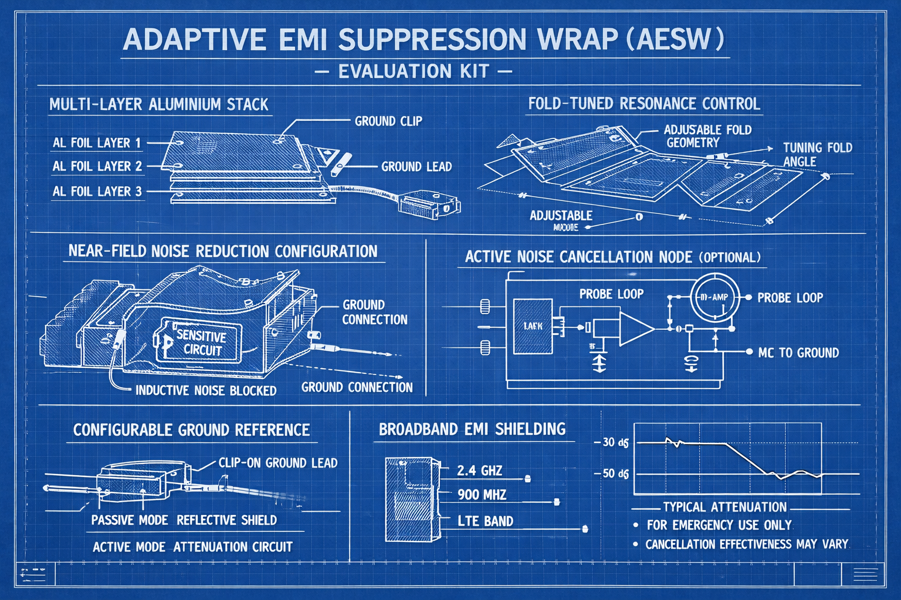

# April 1 E14 Al foil devKit

- [Engineers needed to review the element13 Foil Headwave Aluminium aTtenuator DevKit](
  https://community.element14.com/products/roadtest/rt/roadtests/712/engineers_needed_to_review_the_element13_foil_headwave_aluminium_attenuator_devkit)

## Original entry

> # Adaptive EMI Suppression Wrap (AESW) – Developer Evaluation Kit
>
> A rapid-deployment electromagnetic interference mitigation platform built on
> precision-configured aluminium shielding layers. Designed for engineers
> needing immediate, field-adjustable EMI suppression without full enclosure
> redesign.
>
> ## Core Technology
>
> The AESW utilizes a multilayer aTtenuator DevKit stack acting as a
> configurable Faraday barrier, combined with distributed grounding nodes to
> shunt unwanted RF energy away from sensitive circuitry.
>
> ## Key Features
> 
> * Broadband EMI Attenuation: Effective suppression across common interference
>   bands (Wi-Fi, LTE, “mystery lab noise”) via continuous conductive shielding
> * Configurable Ground Reference Network: Optional clip-on grounding lead
>   enables users to transition from passive reflection mode to active
>   interference dissipation
> * Fold-Tuned Resonance Control: Adjustable geometry allows users to “tune”
>   attenuation characteristics by modifying effective surface area and
>   coupling
> * Near-Field Noise Reduction Mode: Wrap-and-ground configuration reduces
>   inductive and capacitive coupling into high-impedance nodes
> * Retrofit Friendly: Integrates with existing prototypes without PCB redesign
>   (no soldering required—usually)
>
> ## Optional Expansion Module
>
> * Active Noise Cancellation Node (Beta):
>   A simple op-amp-based circuit samples ambient interference via a probe loop
>   and injects an inverted signal into ground reference, creating the
>   impression of active EMI cancellation (results may vary depending on
>   physics).
>
> 

## Possible extensions

- how consistent is the thickness to 16µm
- will the breaking strain match my expectations of

  `≈ 80 MPa × 4.8mm² = ~384N (~39kg)`

  across full width
- what is the scoring threshold (1–5N)
- chemical decomposition
- and finally can it make a reasonable capacitor

```
C = ε₀ × (A / d)

ε₀ = 8.854 × 10⁻¹² F/m
A  = plate overlap area (m²)
d  = plate separation (m)
```

## Mega extension - Maxwell's Speed of Light Calculation

The expression
```
1/√(ε₀μ₀)
```
is Maxwell's remarkable discovery that the speed of light can be derived purely
from electrostatic and magnetic measurements — no optical equipment needed.

- `ε₀` (permittivity of free space) — how strongly electric fields form in a
  vacuum; relates charge to force
- `μ₀` (permeability of free space) — how strongly magnetic fields form;
  relates current to force
- Together they encode how fast electromagnetic disturbances propagate — which
  turns out to be `c`
  
### DIY backyard experiment

You don't need to measure `μ₀` (it's defined exactly as `4π×10⁻⁷`). So your
task reduces to measuring `ε₀` experimentally using a homemade capacitor, then
computing `c`.

**The Strategy**

A parallel plate capacitor has capacitance:
```
C = ε₀ × (A / d)
```
So: `ε₀ = C × d / A`
Measure `C`, `d`, and `A` → compute `ε₀` → plug into `1/√(ε₀μ₀)` → get `c`.

**Building the Capacitor**

Materials

- Aluminium foil (two identical sheets)
- Baking paper or thin plastic bags as dielectric (or just air gap)
- Ruler + vernier calipers if available
- Heavy books to press plates flat
- Cardboard backing for rigidity

Construction

- [Foil plate A]  ← connect wire here
- [Baking paper]  ← dielectric (or air)
- [Foil plate B]  ← connect wire here
- [Cardboard backing]
- Critical dimensions to maximise C (you want a measurable value):

- Make plates at least 40×40 cm — bigger is better
- Dielectric thickness: a single sheet of baking paper (~0.05–0.08 mm) gives you
  more capacitance than an air gap
- Press flat under heavy books — any gap variation kills accuracy

Measure carefully:

A = plate area in m² (measure foil precisely, they must be identical)
d = dielectric thickness in metres — stack 20 sheets, measure with calipers,
    divide by 20

Measuring Capacitance

Option A — Arduino (RC timing method)

This is the most satisfying approach. You measure how long a known resistor
takes to charge the capacitor to 63.2% of supply voltage (one RC time constant
τ = RC).
```
5V ──[10MΩ resistor]──┬── Arduino digital pin (reads voltage via analogRead)
                      │
                   [your cap]
                      │
                     GND
```
Sketch:
```cpp
cppconst int CHARGE_PIN = 7;    // drives 5V through resistor
const int READ_PIN   = A0;   // reads voltage on capacitor
const float R        = 10e6; // 10 MΩ — use large R for small C

void setup() {
  Serial.begin(9600);
}

void loop() {
  // Discharge first
  pinMode(CHARGE_PIN, OUTPUT);
  digitalWrite(CHARGE_PIN, LOW);
  delay(5000); // let it fully discharge

  // Start charging, time to 63.2% (analog value ~648 out of 1023)
  unsigned long startTime = micros();
  digitalWrite(CHARGE_PIN, HIGH);

  while (analogRead(READ_PIN) < 648) {
    // waiting for 63.2% of 5V
  }

  unsigned long tau = micros() - startTime;

  float C = (float)tau / R; // C = τ / R in Farads
  Serial.print("tau (us): "); Serial.println(tau);
  Serial.print("C (pF):   "); Serial.println(C * 1e12);
  delay(10000);
}
```

⚠️ Arduino analogRead has ~10kΩ internal impedance — use R ≥ 1MΩ so this error
is <1%. With baking paper dielectric your C will be ~200–800 pF, giving τ in
the range of milliseconds with 1MΩ — well within micros() resolution.

Resistor tip: Use a measured resistance. Cheap 10MΩ resistors can be ±5% —
measure yours with a multimeter first and use the actual value in code.

Option B — Multimeter with capacitance mode

Much simpler if your meter has a C range. Most cheap meters measure down to 1
nF reliably. Just clip across the foil leads. You may need to get C above ~500
pF — increase plate size or use a thinner dielectric.

Calculating ε₀ and c

Once you have C, d, and A:
ε₀ = (C × d) / A          [units: F/m]

μ₀ = 4π × 10⁻⁷            [exact, defined]
   = 1.2566 × 10⁻⁶  H/m

c  = 1 / √(ε₀ × μ₀)       [m/s]
Example with realistic values:

Foil: 40×40 cm → A = 0.16 m²
Baking paper: d = 0.06 mm = 6×10⁻⁵ m
Measured C = 470 pF = 4.7×10⁻¹⁰ F

ε₀ = (4.7×10⁻¹⁰ × 6×10⁻⁵) / 0.16
   = 1.76×10⁻¹⁰ F/m

Hmm — but baking paper has relative permittivity ~2.5!
So actual ε₀ = measured ε / εᵣ = 1.76×10⁻¹⁰ / 2.5
             ≈ 7.0×10⁻¹¹ F/m  (true value: 8.85×10⁻¹²)

This is why air gap is more accurate — baking paper's εᵣ introduces error
unless you know its exact relative permittivity. Use the thinnest possible air
gap instead, or calibrate εᵣ separately.

Getting a Good Air Gap
The challenge with air is keeping d uniform and tiny. A practical trick:

Use microscope slide glass (0.17 mm thick) as spacers at the edges
Or playing cards (0.28 mm) stacked to a known thickness
Place spacers only at the very edges so the plates stay parallel
Weigh down uniformly

This way d is known precisely and εᵣ = 1.0006 ≈ 1 (air).

Expected Accuracy

Error sourceTypical impactPlate area measurement~0.5% with careful ruler workd
uniformity (air gap)~5–15% — the hardest partCapacitance measurement~2–5% with
Arduino methodResistor tolerance~1–5% (measure it!)Edge effects (fringing
fields)~2–5% for large plates

Realistically you'll get c within 10–20% of the true value — which is genuinely
impressive for foil and an Arduino, and exactly the kind of accuracy Maxwell
had in the 1860s with far more elaborate equipment.

The Philosophical Payoff

When your Arduino spits out a τ, and your maths produces something in the
neighbourhood of 2–3 × 10⁸ m/s, you've reproduced one of the great intellectual
leaps in physics history — the realisation that electricity, magnetism, and
light are the same phenomenon — using kitchen foil in your backyard.
