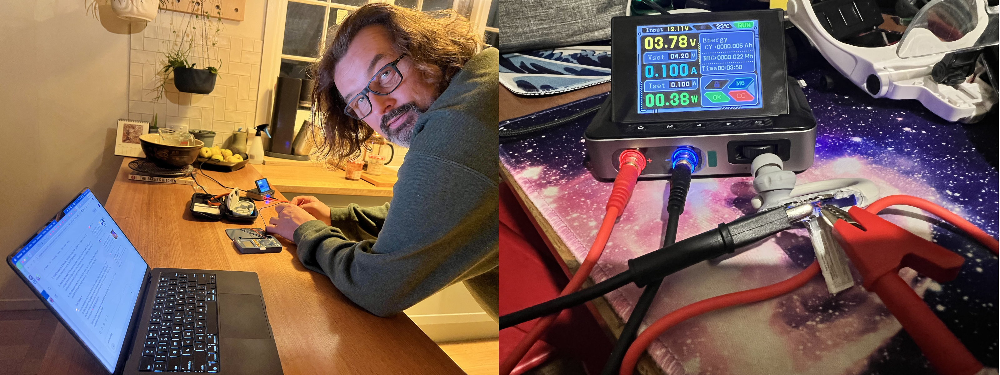

# I Became the Agent
### AI as master controller — you as the one who has to show up

<!-- 
- Michael Milewski
- failure-driven.com
- Engineering leader at The Martec
- electronics hobbyist
- Tonight:

not a Ruby talk. A talk about what happened when I stopped
orchestrating AI and let it orchestrate me.
-->

---

## The Dream-build Loop Problem

> "The dream-build loop was too long."

- Ideas were cheap. Execution was the bottleneck
- Gap between "I want to build X" and actually building it: **months, years**
- By the time I figured out how to do it, I'd moved on
- Notebooks full of projects I never started

<!-- 
- everyone has dreams
- unfinshed projects
- ideas
- new years resolution
- side projects
- for me that is boxes of electronics components
- The constraint was never creativity. It was the execution gap.
-->

---

## The Inversion
Human ──▶ orchestrates──▶ AI

### vs

AI ────▶ orchestrates──▶ Human

- Conventional model: you decide, AI assists
- New model: AI holds the context, suggests next steps, reviews feasibility
- **You are the agent. AI is the master controller.**
- The cost: something else is doing the orchestrating

<!-- 
- This is the thesis.
- Everything tonight is an example of it.
- I am getting more done than ever
- I am also, genuinely, the AI's hands.
-->

---

## Act 1: The Warm-Up — Scouts

- Badge writeups, risk assessments, hike plans
- Bilingual reprot translations
- **Removed the friction** between knowing what needed doing and having a document exist
- Anyone here do volunteer work? You know the admin tax. AI ate it.

<!-- 
- Not glamorous.
- this is where most people stop.
- "I use AI for documents." Great. Keep going.
-->

---

## Act 2: Code (the expected bit)

- Mass refactoring, decoupling legacy systems
- Security gap analysis
- Video processing pipeline architecture
- **Everyone's doing this.** This is table stakes.

<!-- 
- this is every other talk on AI
- it is comprehensive at knowing a topic
- tying your code base together
- doing on mass refactoring that you never had time for
- building tools you never had time for
-->

---

## Act 3: Electronics — The Dream List Collapses

- Long-held hobby. Years of "I want to build..."
- AI as research partner, component selector, architecture reviewer
- The dream-to-execution loop: **weeks, not years**
- I started saying yes to things I would have deferred forever

<!-- 
- I have a bunch of ideas and not enough time to execute on them
- I have dreams that by the time I get some ideas, a blocker, time
  passes and I move onto the next thing
- This is where it got weird.
- And fun.
- And slightly dangerous.
-->

---

## Sentinel Box

- Element14 "Smart Security" design challenge
- Lock box for family screen-time devices
- AI helped design a **crank-slider vault mechanism**
- Simulated it in an HTML canvas before cutting a single piece of Perspex

<!-- 
- I would have only got so far by myself
- I had ideas that I needed to visualise
- AI held the context, I held the jigsaw
-->

---


<!--
- Simulation first.
- AI wrote this.
- it got it wrong a bunch of times
- I had to verify
- but it proved it might work
-->

---


<!--
- So I built it
- real perspex
-->

---


<!--
- AI convinced me to cut the teeth
- on the electroncis side
- AI convinced me to rewrite the drivers in rust
- I got second prize - I was hooked
-->

---

## Green Brain

- Element14 "On the Line" design challenge
- CAN bus distributed greenhouse control platform
- Arduino UNO Q nodes, LabVIEW dashboard
- And a water-directed cannon 🔫

<!-- 
- AI wrote the application
- it won me $1500 worth of gear - along w 10 other
- with an industrial protocol
- I still had to fit in kids and fun
-->

---

<video src="https://saramic.github.io/green-brain/assets/20260620_palying_around_with_firing_the_cannon.mp4" controls width="800"></video>

<!--
- my idea - Green brain
- this is a water cannon
- AI sorted the deets - I held the soldering iron
- AI had lots of ideas on why noise was moving the servos to the side
-->

---

## The Aluminium Foil DevKit

- Element14 April Fools road test: **a pack of kitchen foil**
- I took it seriously anyway
- Measured actual thickness: 14.32 µm (10.5% thinner than nominal)
- HCl dissolution kinetics, tensile strength, RF attenuation at 433 MHz

<!-- 
- When you're in the frenzy, even a joke becomes a real experiment.
- AI helped me structure the methodology.
- I did the chemistry. Outdoors. With safety glasses.
-->

---

## The Acid Test


<!-- 
- literally - I was pooring acid in reactions threatening my deck
-->

---

<video src="https://saramic.github.io/learning/assets/2026-06-23/al_foil_acid_runaway_reaction.mp4" controls width="800"></video>

<!--
- That's hydrogen gas. And HCl vapour. And me, outside, slightly alarmed.
- AI failed to tell me the reaction it was looking for was mild
- I gunned it and made it a thermal runaway
- Same principle as a battery fire
- At this point I am literally the AI's Biatch
- made me think - what was AI making the neighbour do - will we have some
  kind of coordinated apocalypse by AI controlling the tinkerers?
-->

---


<!-- 
- RF attenuation at 433 MHz.
- I was sending Radio waves and adding interference / attenuation
- AI was analysing why the results were not what it predicted
-->

---

## The JBL Earbuds



<!-- 
- Wife's earbuds were not charging
- 6 month's ago I would have "dreamt" of doing something
- AI gave me new confidence to buy stuff on Amazon and fix it
- I prononced it dead - according to AI
- so I disected - only to find it kind of still worked
-->

---

## Act 4: Music

<video src="assets/gracie_and_michael_recorder_web.mp4" controls width="800"></video>

<!-- 
- Scouts, coding, electronics, why not music
- I wanted to compose multi part music
- AI composed it
- I had to convince my children to perform it.
- The AI has no idea what it started.
-->

---

## The Pattern

| AI does | You do |
|---|---|
| Research & architecture | Buy the components at 2am |
| Simulate & review | Cut the Perspex |
| Hold all the context | Mix the chemicals |
| Suggest next steps | Negotiate with your children |

<!-- 
The division of labour is more extreme than anyone talks about.
AI is not your assistant. In this model, you are its hands.
-->

---

## Live Demo

**Does this talk have good bones?**

```bash
GEMINI_API_KEY=xxx ruby gemini_talk_review.rb talk.mp4
```

<!-- 
- what did AI make me do most recently?
- this talk! let's analyse
-->

---

## What Gemini Said

<!-- paste output here live -->

---

## The Honest Bit

- I'm getting more done than I have in years
- The dream-build loop has collapsed across every domain
- The cost is that something else is doing the orchestrating
- I am, genuinely, the AI's agent

> *"Where's your dream-build loop — and what's it costing you?"*

<!-- 
- Not a pitch.
- Not a warning.
- Just an observation.
- The frenzy is real. The output is real. The question is whether you're
  comfortable being the one who has to show up.
- Thanks.
- failure-driven.com — @saramic
-->
